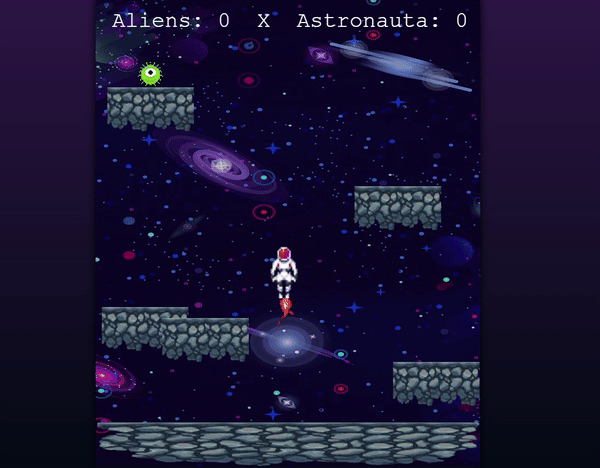

## ❓ How does the game work?

In this Phaser exercise, Aliens are automatically and randomly released onto the map, and you control the astronaut whose task is to capture the aliens. The alien disappears after a random period of time, and if it disappears without being captured, it counts as a point for the alien; if it is captured, it counts as a point for the astronaut. All of this takes place in a space-themed context, specifically on the moon, which is represented by the main platform of the game along with various smaller lunar rocks distributed throughout the map.

## 🌐 Demonstration

    

